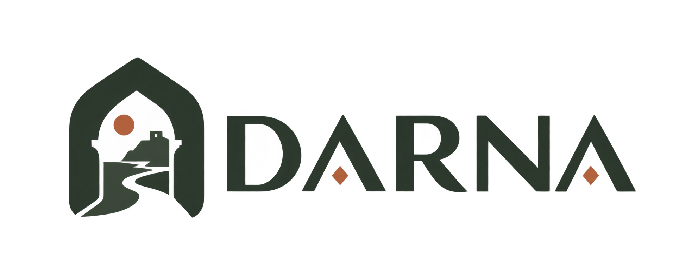

<div align="center">

  

# DARNA · دارنا

**Authentic Vacation Rentals & Stay Experiences Tailored for Algeria and Beyond**

  <p align="center">
    A modern, bilingual, full-stack rental platform built with Next.js 14 App Router, TypeScript, and an Earthy Minimal design system. Featuring cultural heritage landmarks, interactive Leaflet maps, real-time messaging, comprehensive admin analytics, and native Arabic RTL support.
  </p>

  <!-- Badges -->
  <p align="center">
    <a href="https://github.com/med-amine-ok/darna"></a>
    <a href="https://nextjs.org/"></a>
    <a href="https://www.typescriptlang.org/"></a>
    <a href="https://tailwindcss.com/"></a>
    
  </p>

  <p align="center">
    <a href="#-overview">Overview</a> ·
    <a href="#-key-features">Features</a> ·
    <a href="#-design-system--earthy-minimal">Design System</a> ·
    <a href="#-getting-started">Quickstart</a> ·
    <a href="#-demo-credentials">Demo Accounts</a> ·
    <a href="#-project-architecture">Architecture</a>
  </p>

</div>

---

## 🌟 Overview

**DARNA** (دارنا — _"Our Home"_) is a purpose-crafted hospitality and vacation rental ecosystem designed to showcase Algeria's diverse regions—from coastal Mediterranean villas in Tipaza and Algiers, to the dramatic cliffs of Constantine, and Saharan desert retreats in Taghit and Djanet.

DARNA replaces standard generic booking templates with a culturally rooted, performant, and accessible experience:

- **Bilingual & RTL-First**: Effortless switching between **Arabic (العربية)** with native Right-to-Left (RTL) orientation, **French (Français)**, and **English**.
- **Algerian Identity**: Dynamic localized hero _"وين دارنا ؟"_ with animated destination prompts and an architectural vector outline celebrating iconic Algerian monuments (Maqam Echahid, Djamaa el Djazaïr, Sidi M'Cid Suspension Bridge, Tipaza Roman Ruins, Casbah, and Sahara dunes).
- **Earthy Minimal Aesthetics**: A custom palette inspired by Mediterranean pine, desert sands, terracotta clay, and warm limestone.
- **Full Operational Suite**: Guest booking, Host property management, real-time messaging, and an enterprise Admin dashboard with interactive SVG performance analytics.

---

## ✨ Key Features

### 🏡 Guest Experience

- **Interactive Multi-Param Search**: Search by destination (Algerian wilayas & international cities), flexible date ranges, and guest capacities. Left-aligned inputs with intuitive pill filters.
- **Dynamic Category Browsing**: Discover listings categorized by environment: Beachfront, Traditional Dar & Riads, Mountain Lodges, Desert Camps, Historic Casbahs, and Luxury Villas.
- **Interactive Map Exploration**: Integrated Leaflet maps with custom geo-markers, coordinates preview, and smooth pan-to-listing navigation.
- **Favorites & Wishlists**: One-tap bookmarking persisted across browsing sessions.
- **Detailed Listing Showcase**: High-resolution image galleries, host profiles, included amenities, dynamic pricing calculators, and guest reviews.

### 💬 Real-Time Messaging Center

- **Dedicated Chat Workspace**: Split-view responsive messaging with an independent user/conversation list and focused thread view.
- **Conversation Tracking**: Unread counts, timestamps, user avatars, and instant message dispatch.

### 🛠️ Host Suite ("DARNA your home")

- **Step-by-Step Creation Wizard**: Guided 6-step onboarding flow for listing properties:
  1. **Category**: Choose the property style (Villa, Dar, Camp, etc.)
  2. **Location**: Interactive map placement with wilaya / city selection
  3. **Capacity**: Guest, bedroom, and bathroom counters
  4. **Photos**: Upload and manage property images
  5. **Description**: Listing title, tagline, and details
  6. **Pricing**: Set transparent nightly pricing (DZD / DZD / EUR)
- **Reservation Management**: Track upcoming, active, and completed guest reservations.

### 📊 Admin Control Center

- **Executive KPIs**: Real-time cards tracking Gross Revenue, Total Bookings, Active Listings, and Verified Host counts with percentage trends.
- **Interactive SVG Analytics**: Custom vector Area trend charts (Revenue vs Bookings) and Donut distribution charts (Property breakdown by category) built without heavy third-party charting libraries.
- **Content & Entity Moderation**:
  - Property moderation & status toggles
  - Booking lifecycle review (Pending, Confirmed, Cancelled)
  - User role management (Guest, Host, Admin)
  - Review moderation & rating analytics

---

## 🎨 Design System — Earthy Minimal

DARNA uses a curated **Earthy Minimal** palette replacing harsh primary colors with warm, grounding Mediterranean and North African tones:

| Token        | Hex       | Name                | Role & UI Usage                                                 |
| ------------ | --------- | ------------------- | --------------------------------------------------------------- |
| `primary`    | `#2E3A2F` | Deep Charcoal Green | Headers, active tabs, primary action buttons, dark mode accents |
| `secondary`  | `#6B7F5B` | Sage Green          | Badges, success states, subtle icons, secondary buttons         |
| `tertiary`   | `#D9C9B2` | Warm Sand / Beige   | Dividers, subtle borders, card background highlights            |
| `accent`     | `#C96F4F` | Terracotta Clay     | Badges, call-to-actions, price tags, special highlight accents  |
| `background` | `#F8F6EE` | Warm Off-White      | Application base canvas, modal backgrounds, container backdrops |

---

## 🚀 Getting Started

### Prerequisites

- **Node.js**: v18.17.0 or higher
- **npm**, **yarn**, or **pnpm**
- **Git**

### Installation

1. **Clone the repository:**

   ```bash
   git clone https://github.com/med-amine-ok/darna.git
   cd darna
   ```

2. **Install dependencies:**

   ```bash
   npm install
   ```

3. **Configure Environment Variables:**
   Create a `.env` file in the root directory:

   ```env
   # Authentication
   NEXTAUTH_SECRET="your-super-secret-key-change-in-production"
   NEXTAUTH_URL="http://localhost:3000"

   # Optional Database & Media Configuration (if connecting to external providers)
   # DATABASE_URL="mongodb+srv://..."
   # NEXT_PUBLIC_CLOUDINARY_CLOUD_NAME="your_cloud_name"
   ```

4. **Run the Development Server:**

   ```bash
   npm run dev
   ```

5. **Open in Browser:**
   Navigate to [http://localhost:3000](http://localhost:3000) (automatically routes to your language of choice, e.g. `/ar`, `/fr`, or `/en`).

---

## 🔑 Demo Credentials

For testing and evaluation, pre-configured accounts with mock authentication support are available:

| Role      | Email                    | Password      | Permissions & Views                                                            |
| --------- | ------------------------ | ------------- | ------------------------------------------------------------------------------ |
| **Admin** | `alex.morgan@darna.com`  | `password123` | Full access to `/admin` dashboard, KPIs, performance charts, entity moderation |
| **Host**  | `sophia.chen@darna.com`  | `password123` | Property listing creation, reservation manager, host dashboard                 |
| **Guest** | `marcus.vance@darna.com` | `password123` | Browsing, wishlists, booking checkout flow, messaging                          |

---

## 🏗️ Project Architecture

```
darna/
├── app/
│   ├── [locale]/               # Next-Intl localized route tree
│   │   ├── admin/              # Admin dashboard & analytics views
│   │   ├── favorites/          # Saved properties
│   │   ├── listings/           # Property details & reservation view
│   │   ├── messages/           # Real-time messaging split-view interface
│   │   ├── properties/         # Host property manager
│   │   ├── reservations/       # Guest reservation history
│   │   ├── layout.tsx          # Localized root layout (RTL/LTR dynamic direction)
│   │   └── page.tsx            # Main landing page with Cultural Hero & Listing feed
│   ├── api/                    # NextAuth & REST API routes
│   ├── favicon.ico             # Branded DARNA favicon
│   ├── icon.png                # PWA high-res icon
│   └── layout.tsx              # Root fallback layout
├── components/
│   ├── admin/                  # Admin KPIs, Charts (SVG Area & Donut), Entity tables
│   ├── home/                   # HomeHero, AlgerianSkyline, Categories bar
│   ├── listings/               # ListingCard, ListingHead, ListingInfo, ListingReservation
│   ├── messages/               # MessageThread, ConversationList, ChatInput
│   ├── modals/                 # LoginModal, RegisterModal, RentModal (Listing wizard), SearchModal
│   ├── navbar/                 # Branded Navbar, Search bar, UserMenu, LanguageSwitcher
│   └── inputs/                 # CategoryInput, Calendar, Counter, ImageUpload, WilayaSelect
├── lib/
│   ├── auth.ts                 # NextAuth configuration & mock credential handlers
│   └── mockAdminData.ts        # Mock data & chart metrics for admin analytics
├── messages/                   # Internationalization translation dictionaries
│   ├── ar.json                 # Arabic (العربية)
│   ├── fr.json                 # French (Français)
│   └── en.json                 # English
├── public/
│   ├── assets/                 # DARNA logos (horizontal, vertical, icon), avatars, skyline art
│   └── manifest.json           # Web App Manifest
├── styles/
│   └── globals.css             # Tailwind layers, custom scrollbars, datepicker themes
├── tailwind.config.js          # Earthy Minimal design tokens (50-900 scales)
└── tsconfig.json
```

---

## 🌐 Localization (i18n)

DARNA is engineered from the ground up for multi-language and bidirectional support using `next-intl`:

- **Arabic (`ar`)**: Full RTL layout mirroring (`dir="rtl"`), specialized typography spacing, and cultural terminology.
- **French (`fr`)**: Complete French localization tailored for North African francophone users.
- **English (`en`)**: International standard localization.

Language selection is preserved across navigation and can be switched dynamically from the language dropdown in the header.

---

## 📜 License & Credits

Built with pride for Algeria and travel lovers everywhere.  
Repository maintained by [med-amine-ok](https://github.com/med-amine-ok).
